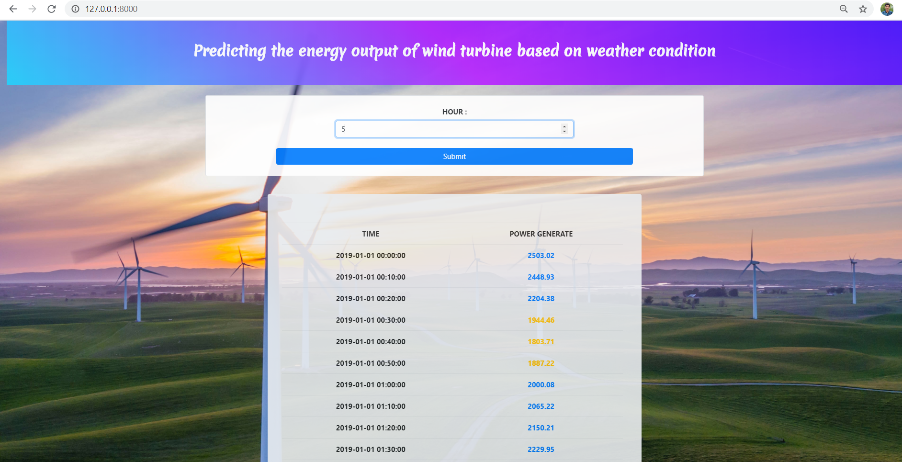

# Predicting Energy of wind turbine (Time Series)

### Technology
Deep Learning Model : LSTM

### Problem Description :
Wind energy plays an increasing role in the supply of energy world-wide. The energy output of a wind farm is highly dependent on the wind conditions present at its site. If the output can be predicted more accurately, energy suppliers can coordinate the collaborative production of different energy sources more efficiently to avoid costly overproduction.

### Solution :
Develop a time series model to Predict the power output of wind farm based on the weather condition in the site (1Hr prediction to 72Hrs. prediction), And recommend the Power Grid to suggest the best time to utilize the energy from wind farm

### Output Screenshot :

